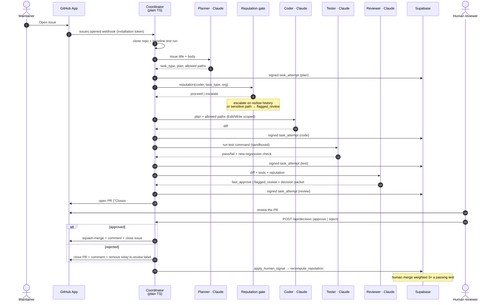

# Relay — Coding agents ship on trust. Relay makes them earn it.

> **"Agents don't need more autonomy — they need a track record."**
> Four agents. One reputation gate. Zero auto-merges.

Relay is a reputation-gated autonomous pull-request system. It takes a GitHub issue
to a ready-to-merge PR with four headless Claude agents — Planner, Coder, Tester,
Reviewer — gates every handoff on a signed, per-category trust score, and **never
merges without a human**. Built on Node 22 + TypeScript, a GitHub App
(`@octokit/*`), Supabase (Postgres + RLS), Ed25519 `did:key` attestations,
Docker-sandboxed test runs, and a Next.js 15 dashboard.

> Design spec: [`relay-project-description.md`](./relay-project-description.md)
> · Setup & build status: [`backend/README.md`](./backend/README.md)
> · Pitch deck: `frontend/app/pitch` → `/pitch`

---

## The Problem in one line

Autonomous coding agents already open pull requests at scale — and **46% of their
bug-fix PRs are closed without ever merging (1,497 of 3,225)**, because nothing
decides, *before* the PR exists, whether the agent has earned the right to act on
this kind of change.

---

## Market Context

| Metric | Number | Source |
|---|---|---|
| AI-agent bug-fix PRs rejected | **46.41%** — 1,497 of 3,225 | [arXiv:2606.13468](https://arxiv.org/abs/2606.13468) |
| Agent-authored PRs analysed | **~33,000** | [MSR 2026 Mining Challenge](https://2026.msrconf.org/) |
| Merged agent PRs that still needed reviewer fixes | **15.4%** | [arXiv:2605.22534](https://arxiv.org/abs/2605.22534) |
| Cursor rejections — "introduces bugs / breaks APIs" | **46.7%** | [arXiv:2604.19965](https://arxiv.org/abs/2604.19965) |
| Devin PRs abandoned / inactive | 31.6% | [arXiv:2604.19965](https://arxiv.org/abs/2604.19965) |
| GitHub Copilot coding agent | GA — opens PRs from assigned issues | [github.blog](https://github.blog/) |

---

## Problem 1 — Agents open PRs with no track record

Every agent PR is triaged the same way: it lands in the queue, a human reads the
whole diff, CI runs. There is no notion of *this agent scores 0.9 on CSS fixes and
0.4 on migrations* — so every PR costs a full review regardless of who wrote it or
what it touches.

| Signal | Value | Source |
|---|---|---|
| Fix PRs closed unmerged | 1,497 of 3,225 (46.41%) | [arXiv:2606.13468](https://arxiv.org/abs/2606.13468) |
| Unmerged vs merged agent PRs | larger, riskier, fail project CI first | [MSR 2026](https://2026.msrconf.org/) |
| Genuine agent-failure rate (forgiving re-analysis) | 35.7% | [arXiv:2605.22534](https://arxiv.org/abs/2605.22534) |

**Bottom line:** Reviewer effort is spent uniformly on output of wildly uneven
quality.

**Relay fix:** A reputation gate sits between Planner and Coder. It reads the
Coder's live `relay_trust_score` for this exact `task_type` and routes the run to
**fast-approve** (proven) or **flagged review** (unproven / sensitive) *before a
line is written*.

---

## Problem 2 — The rejections are the same failure, repeated

Agent PRs don't fail on formatting. They fail on correctness and value — the same
categories, across every vendor.

| Agent | Top rejection reason | Share | Source |
|---|---|---|---|
| Cursor | "introduces bugs / breaks APIs" | 46.7% | [arXiv:2604.19965](https://arxiv.org/abs/2604.19965) |
| Devin | PR goes inactive / abandoned | 31.6% | [arXiv:2604.19965](https://arxiv.org/abs/2604.19965) |
| GitHub Copilot | "introduces bugs" | 10.7% | [arXiv:2604.19965](https://arxiv.org/abs/2604.19965) |
| GitHub Copilot | "doesn't add value" | 8.7% | [arXiv:2604.19965](https://arxiv.org/abs/2604.19965) |

**Bottom line:** The failure mode is predictable, so it can be gated against.

**Relay fix:** The Planner declares a file scope; the Coder is **tool-locked** to it
(`Edit` / `Write` on the declared globs only). The Tester runs the suite on a
**pristine baseline clone first**, so only a *new* regression fails the task — not
pre-existing noise. Scope drift or a new failure → flagged review, never a silent
merge.

---

## Problem 3 — Even merged agent PRs aren't clean

The PRs that pass review still aren't safe: reviewers routinely fix the agent's work
*inside* the merge.

| Metric | Number | Source |
|---|---|---|
| Merged agent PRs needing reviewer intervention | 15.4% | [arXiv:2605.22534](https://arxiv.org/abs/2605.22534) |

**Real cost, without a trust layer:**

| | Today |
|---|---|
| Every agent PR | full line-by-line review |
| ~1 in 7 merged PRs | reviewer silently patches the agent mid-merge |
| Trust signal retained afterwards | none — the next PR starts from zero |

**Relay fix:** Every handoff writes a **signed `task_attempt`** (Ed25519, canonical
JSON, chained by `parent_attempt_id`). The human's approve / reject is itself a
signed `human_override` that feeds `apply_human_signal` → `recompute_reputation`.
Trust compounds; a rejection pulls it hard toward zero.

---

## Summary: Three Problems, Gated

| Problem | Real-world cost | Relay's gate |
|---|---|---|
| No per-agent track record | 46% of fix PRs rejected after a full review | Reputation gate *before* coding — `relay_trust_score(agent, task_type, org)` |
| Predictable correctness failures | Cursor 46.7% "breaks APIs"; Devin 31.6% abandoned | Declared scope + Coder tool-lock + baseline-diff Tester |
| Merged ≠ clean | 15.4% of merged PRs patched by a reviewer | Signed attestation chain + human signal → trust score |

---

## Without Relay vs With Relay

| Risk | Without Relay | With Relay |
|---|---|---|
| Unproven agent acts unsupervised | Any agent PR can be fast-tracked by a tired reviewer | Fast-approve blocked until trust ≥ policy threshold for this `task_type` |
| Scope creep | Agent edits anything it wants | Coder tool-locked to the Planner's declared paths |
| CI noise hides real regressions | Reviewer eyeballs a red build | Baseline diff — only a **new** failure line fails the task |
| Disputed / tampered history | "trust me, the bot ran it" | `did:key` signature re-verified in the browser — edit a row, ✓ turns ✗ |
| Silent auto-merge | Some agents merge themselves | **Relay never merges** — squash-merge only on a signed human approve |
| Untrusted test execution | Suite runs on the host | `docker run --rm --network none --cpus 2 --memory 2g --pids-limit 512` |

---

## Comparison with other tools

| Capability | Copilot coding agent | OpenHands | CodeRabbit | **Relay** |
|---|---|---|---|---|
| Writes the fix | ✅ | ✅ | ❌ review only | ✅ 4-agent swarm |
| Reviews the diff | ➖ basic | ❌ | ✅ deep, line-by-line | ✅ Reviewer + decision packet |
| Acts **before** the PR exists | ❌ after | ❌ after | ❌ post-hoc | ✅ the gate decides if it acts |
| Merges without a human | ❌ | ➖ often just opens | — n/a | 🔒 never, by design |
| Per-category reputation from **verified** outcomes | ❌ | ❌ | ❌ | ✅ |
| Review effort scaled to earned trust | ❌ every PR the same | ❌ | ❌ same depth every PR | ✅ fast-approve vs flagged |
| Scope committed & enforced before coding | ❌ starts from the issue | ❌ | — n/a | ✅ Planner declares · Coder tool-locked |
| Portable signed agent identity (DID) | ❌ | ❌ | ❌ | ✅ `did:key` + Ed25519 |

**vs CodeRabbit** — reviews any diff after it exists, one fixed depth, no
reputation. Relay decides *before* the PR whether the agent should act, and
calibrates the human's scrutiny. Complementary — CodeRabbit can review the diff
Relay's swarm produces.

**vs Copilot / OpenHands** — one fixed process, every PR reviewed identically, no
identity, no earned trust. In Relay, scrutiny is a function of what the agent has
proven on this kind of change.

---

## The Relay pipeline

```
issue → Planner → [reputation gate] → Coder → Tester → Reviewer → PR → human → merge
```

The **Coordinator is plain TypeScript, not an LLM.** It clones the repo, runs a
baseline test pass, then drives four headless `claude -p` agents against the
machine's Claude Code login — **no `ANTHROPIC_API_KEY`.**

| Agent | Job | Tools |
|---|---|---|
| **Planner** | issue → `task_type`, plan, declared file scope | none (JSON out) |
| **Coder** | edit the clone, scoped to the plan's paths | `Edit` / `Write`, `acceptEdits` |
| **Tester** | run the suite, no writes | `Bash(npm:*)` only |
| **Reviewer** | diff + tests + reputation → decision | none (JSON out) |

**Trust score** — moves only on test-verified and human-verified outcomes:

```
relay_trust_score = (tests_ok + 3·approvals + 1)
                    ───────────────────────────────────────────
                    (tests_total + 3·(approvals + rejections) + 2)
```

New agent = **0.50** · a human approval is worth **3× a passing test** · one
rejection pulls the score hard toward 0 · scores are scoped per
`(agent, task_type, org)`.

---

## How a run works



---

## Tech stack

### Backend — `backend/` (Node 22, TypeScript, ESM)

| Area | Choice |
|---|---|
| Runtime | Node 22, `tsx` (no build step in dev) |
| HTTP | `express` — GitHub App webhook receiver + `POST /api/decision` |
| Agents | `claude -p --output-format json` subprocesses — machine Claude Code login, **no API key** |
| GitHub | `@octokit/app`, `@octokit/rest`, `@octokit/webhooks`; `smee-client` tunnel in dev |
| Identity | `@noble/ed25519`, `@noble/hashes`, `@scure/base` — Ed25519 → `did:key` (`0xed01` multicodec + base58btc); canonical JSON sign/verify |
| Data | `@supabase/supabase-js` (service-role client) |
| Path scoping | `minimatch` — Coder tool-locked to the Planner's declared globs |
| Sandbox | Docker — `docker run --rm --network none --cpus 2 --memory 2g --pids-limit 512`, host fallback |
| Config | `dotenv` |

### Data — Supabase (Postgres + Data API + RLS)

| Object | Purpose |
|---|---|
| `agents` | the four agent DIDs + public keys |
| `tasks` | one row per issue picked up (`org_slug`, status state machine) |
| `task_attempts` | signed attestation per handoff, chained by `parent_attempt_id` |
| `reputation_scores` | `(org_slug, agent_id, task_type)` → success/total, human approvals/rejections |
| `relay_policies` | per-repo `trust_threshold`, `min_history`, `sensitive_paths[]`, auto-approve / always-flag task types |
| `orgs` | multi-org isolation |
| RPC | `relay_trust_score`, `recompute_reputation`, `apply_human_signal`, `relay_current_org` |

### Frontend — `frontend/` (Next.js 15 dashboard)

| Area | Choice |
|---|---|
| Framework | Next.js 15 (App Router), React 19 |
| Trust graph | `@xyflow/react` (React Flow) — live nodes as the pipeline runs |
| Data | `@supabase/supabase-js`, scoped by `x-relay-org` |
| In-browser verify | `@noble/ed25519` + `@scure/base` port — tamper a row, badge flips ✓→✗ |
| Routes | `/dashboard` · `/graph` · `/tasks` · `/approvals` · `/agents` · `/pitch` |

---

## Repository layout

```
relay/
├── relay-project-description.md   design spec — the source of truth
├── backend/                       coordinator, agents, identity, GitHub App, Supabase
│   ├── src/
│   │   ├── server.ts              GitHub App webhook receiver
│   │   ├── index.ts               CLI entrypoint (issue / run)
│   │   ├── coordinator/           pipeline, reputation gate, policy, sandbox, notify, decision
│   │   ├── agents/                headless claude -p runner + planner/coder/tester/reviewer
│   │   ├── identity/              did:key, canonical JSON, sign/verify
│   │   ├── db/                    service-role client, row types, tasks/attempts writers
│   │   └── github/                App → installation token, Octokit PR open
│   ├── supabase/migrations/       schema, seed agents, trust score, policy + org
│   └── sandbox/Dockerfile         node:20-bookworm-slim test sandbox
└── frontend/                      Next.js dashboard + pitch deck
    ├── app/                       dashboard, graph, tasks, approvals, agents, pitch
    ├── components/dashboard/      Shell, TrustGraph, AttemptNode
    └── lib/                       supabase client, data hooks, in-browser verify
```

---

## Quick start

Full setup (Supabase link, migrations, keypairs, GitHub App) is in
[`backend/README.md`](./backend/README.md).

```bash
# backend
cd backend
npm install
cp .env.example .env            # Supabase keys + GitHub App; agents use the Claude Code login
npm run keys:gen                # write the four agent keypairs (git-ignored)
npm run db:push                 # seed the agent DIDs

npm run pipeline -- issue "Fix login button overflow on mobile" \
  --body "…" --repo owner/name  # real clone + real PR

npm run serve                   # or: GitHub App webhook receiver on :8787
```

```bash
# frontend
cd frontend
npm install
npm run dev                     # dashboard + /pitch on :3000
```

---

**The rule, restated:** Relay prepares the fix and tells you how much to trust it.
You decide whether it merges.
